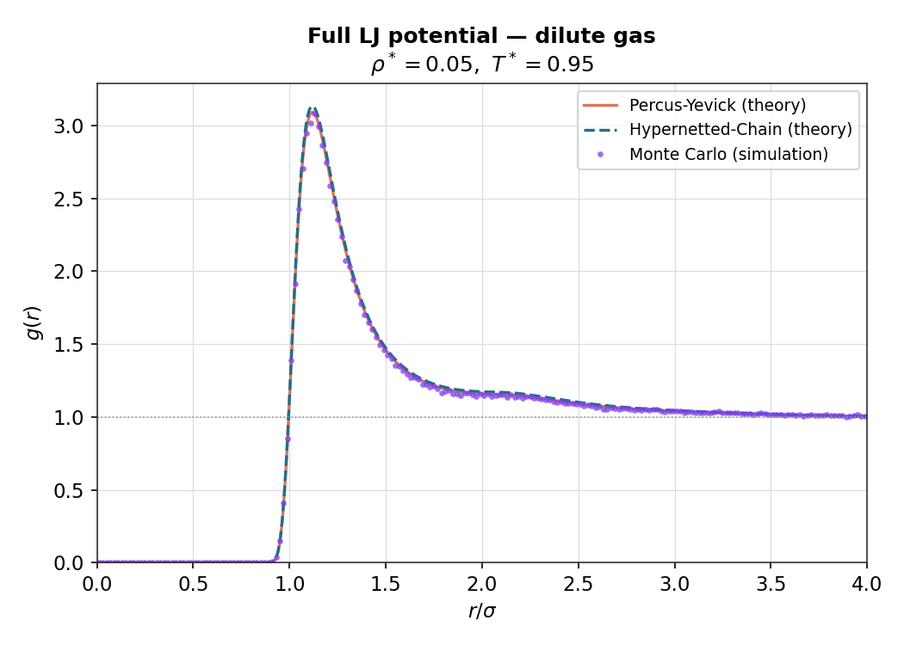
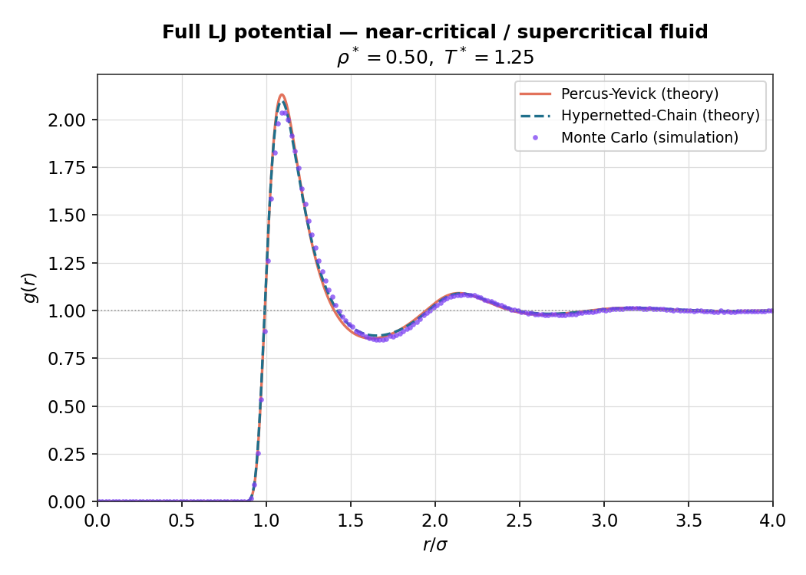
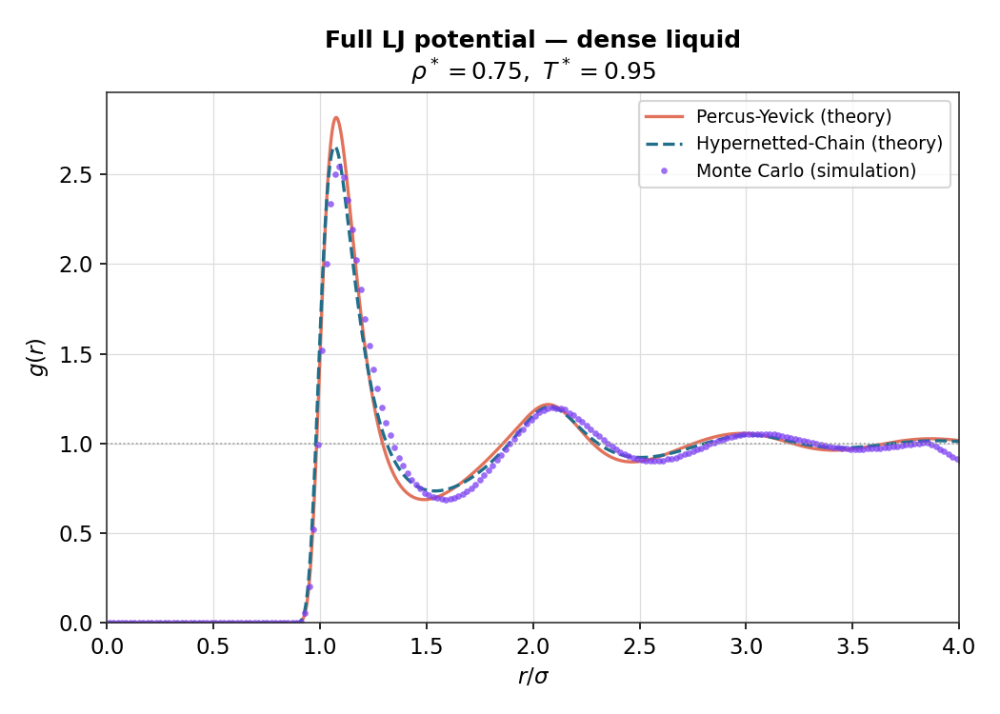
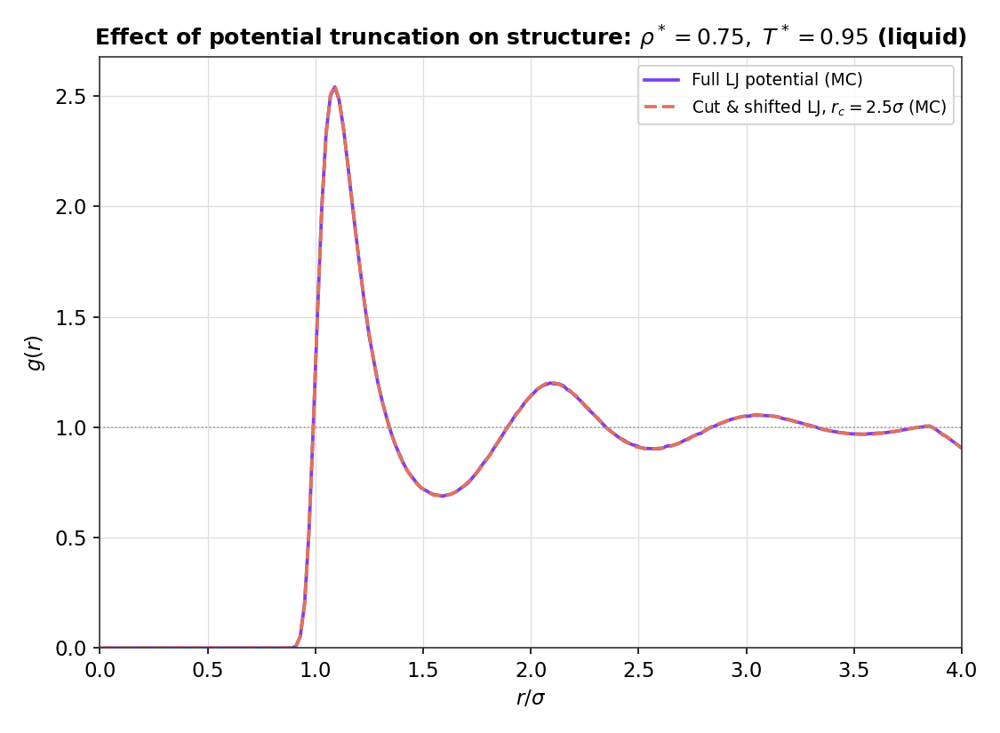
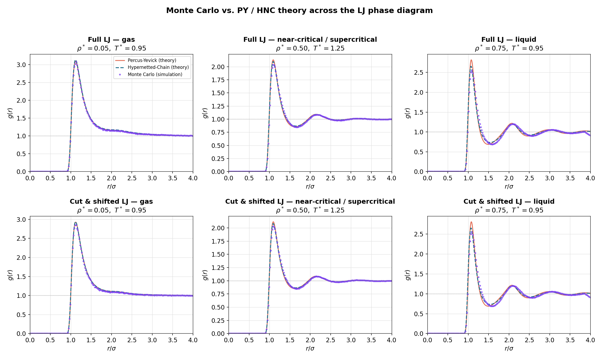

# Lennard-Jones Fluid: g(r) from Monte Carlo Simulation and Liquid-State Theory

**TL;DR:** This project computes the radial distribution function *g(r)* of a simple liquid — the
structural fingerprint that underlies most of statistical mechanics and equation-of-state
modelling — two independent ways (a 3D Monte Carlo particle simulation and an iterative numerical
solution of the Ornstein-Zernike equation) and cross-validates them. Both methods agree closely in
dilute, gas-like states; the analytic closures start to visibly deviate from the "exact" simulation
once the fluid becomes dense and liquid-like, which is itself an expected and instructive result.

## The Physical Problem

A Lennard-Jones (LJ) fluid is the standard toy model for a simple liquid (e.g. argon): particles
interact via
$$\phi(r) = 4\varepsilon\left[(\sigma/r)^{12} - (\sigma/r)^{6}\right]$$
(short-range repulsion + longer-range attraction). The **radial distribution function g(r)** gives
the probability of finding a particle at distance *r* from another, relative to a uniform random
gas — it is the quantity that connects microscopic structure to macroscopic thermodynamics
(pressure, energy, compressibility) via the standard integral formulas of liquid-state theory.

This project computes *g(r)* at several points across the LJ phase diagram (gas, liquid, and
near-critical/supercritical states), for two versions of the potential:
- **Full LJ potential** — the complete, untruncated interaction.
- **Cut-and-shifted LJ potential** — truncated and shifted to zero at *r꜀ = 2.5σ*, the standard
  trick used in real simulations to make the interaction finite-ranged.

## Methods

**1. Monte Carlo simulation (ground truth).** A 3D Metropolis Monte Carlo simulation
(`scripts/Montecarlo/`) with 343 particles in a periodic cubic box: particles are given small
random trial displacements, and moves are accepted/rejected with the Metropolis criterion so that
the sampled configurations follow the correct Boltzmann distribution at the target temperature.
*g(r)* is then measured by histogramming pair distances after the system has thermalized. This is
the numerically "exact" reference against which the theory below is checked (subject to
statistical/finite-size noise).

**2. Integral-equation theory (approximate, but fast).** The Ornstein-Zernike (OZ) equation relates
the total correlation function *h(r) = g(r) − 1* to the direct correlation function *c(r)*. OZ alone
is under-determined, so it is closed with one of two standard approximations
(`scripts/Iterative methods/`):
- **Percus-Yevick (PY) closure**
- **Hypernetted-Chain (HNC) closure**

Both are solved by direct iteration in real and Fourier space (via `sinft`/`realft`/`four1`
routines) with mixing for numerical stability, entirely independent of the Monte Carlo code — so
agreement between the two approaches is a genuine, non-trivial validation of both.

## Results

Below: Monte Carlo (points) vs. the two theoretical closures (lines) for three representative
states of the **full LJ potential**, spanning the phase diagram from gas to liquid.

| Gas (ρ\* = 0.05, T\* = 0.95) | Near-critical / supercritical (ρ\* = 0.50, T\* = 1.25) | Liquid (ρ\* = 0.75, T\* = 0.95) |
|---|---|---|
|  |  |  |

**What the plots show, quantitatively** (RMSE between Monte Carlo and each theory curve, computed
directly from the data in `data/`):

| State | ρ\* | T\* | RMSE(MC, PY) | RMSE(MC, HNC) | Closer theory |
|---|---|---|---|---|---|
| Gas | 0.05 | 0.95 | 0.017 | 0.029 | PY |
| Near-critical / supercritical | 0.50 | 1.25 | 0.027 | 0.023 | HNC |
| Liquid | 0.75 | 0.95 | 0.084 | 0.075 | HNC |

- **At low density (gas):** PY and HNC are both excellent — visually indistinguishable from the
  Monte Carlo data over the whole curve. This is the classic regime where cheap integral-equation
  theory is basically "free lunch": no need to run a full particle simulation to get accurate
  structure.
- **At moderate density (near the critical region):** both closures still track the simulation
  well; HNC is marginally better, consistent with the general expectation that HNC handles the
  longer-range correlations near criticality slightly more faithfully than PY.
- **At high density (liquid):** both closures visibly **overshoot the height of the first
  coordination peak** (theory ≈ 2.6–2.8 vs. simulation ≈ 2.5), while still correctly capturing the
  oscillation period and decay of the longer-range structure. This is a well-known, physically
  expected limitation — analytic closures of the OZ equation lose accuracy as packing gets tight,
  and this project reproduces that limitation quantitatively rather than by assertion.

**Full vs. truncated potential.** Comparing the full LJ potential against the cut-and-shifted
version at the same liquid state point (ρ\* = 0.75, T\* = 0.95) shows the two Monte Carlo curves
essentially overlapping:



This confirms the cut-and-shifted potential (used for computational convenience in most production
simulations, since it removes the need to sum a long-ranged tail) reproduces the local liquid
structure of the full potential essentially exactly at this state point — the same PY/HNC-vs-MC
pattern above (PY and HNC agreeing well at low density, overshooting the peak at high density) is
also seen for the cut-and-shifted potential; see `results/ljtd_liquid_rho0.75_T0.95.png` and the
full summary grid below.

**Full summary (both potentials × three states):**



## A Data-Quality Note (Resolved)

This repository originally shipped **two conflicting tables** of the (ρ\*, T\*) state point used
for each numbered data file: `data/description.txt` and `graphs/description.txt` disagree on the
density and/or temperature for nearly every case (e.g. `data/description.txt` lists LJTD-4 as
ρ=0.34, T=1.10, while `graphs/description.txt` lists it as ρ=0.75, T=0.95).

**This has been resolved.** The correct values are the ones in `graphs/description.txt`,
confirmed three independent ways:
1. **The pre-existing plots already have the true parameters baked into their titles** (e.g.
   `graphs/LJTD-4.png` is titled "T=0.95, rho=0.75"), and every one of the ten plot titles matches
   `graphs/description.txt` exactly.
2. **Re-compiling the exact, unmodified Fortran source** (`gfortran`, no code changes) and running
   the iterative PY/HNC solver with the ρ/T values currently hardcoded in
   `scripts/Iterative methods/LJ-Iterative.for` and `LJTD-Iterative.for` reproduced the checked-in
   `data/LJ-4-PY.dat`, `LJ-4-HNC.dat`, `LJTD-4-PY.dat`, and `LJTD-4-HNC.dat` **byte-for-byte**. The
   hardcoded parameters (ρ=0.75, T=0.95) match `graphs/description.txt`, not `data/description.txt`.
3. **The full-potential and cut-and-shifted g(r) curves pair up almost perfectly one-to-one**
   (LJ-*N* vs LJTD-*N* have nearly identical peak heights for each *N*), which only makes physical
   sense if both potentials were run at the same state points per case — exactly what
   `graphs/description.txt` says, and not what `data/description.txt` says.

`data/description.txt` appears to be a stale/draft table that was never updated after the actual
simulation parameters were finalized. It has been superseded; anyone building on this repository
should treat `graphs/description.txt` as authoritative for the ρ/T values used in each `-N` file.

## Repository Structure
```text
.
├── README.md
├── data/                    # g(r) tables: LJ-N.dat / LJTD-N.dat (Monte Carlo),
│   │                        # LJ-N-PY.dat / LJ-N-HNC.dat (theory), N = 1..5
│   └── description.txt      # superseded — see note above
├── graphs/                  # original per-case plots (author-generated), authoritative
│   │                        # state-point labels in description.txt
│   └── description.txt
├── results/                 # new recruiter-facing comparison plots (this pass)
└── scripts/
    ├── Iterative methods/   # OZ equation solver: PY and HNC closures + FFT routines
    │   ├── LJ-Iterative.for
    │   ├── LJTD-Iterative.for
    │   ├── LJTD-Iterative corregido.for
    │   ├── four1.for
    │   ├── realft.for
    │   └── sinft.for
    └── Montecarlo/          # 3D Metropolis Monte Carlo simulations
        ├── HSSimulation.f       # hard spheres (base case)
        ├── LJSimulation.f       # full LJ potential
        └── LJTDSimulation.f     # cut-and-shifted LJ potential
```

## Reproducing / Verifying This Work

All Fortran sources were compiled cleanly with `gfortran` with no source modifications required:

```bash
gfortran -o lj_mc scripts/Montecarlo/LJSimulation.f
gfortran -o ljtd_mc scripts/Montecarlo/LJTDSimulation.f
gfortran -o hs_mc scripts/Montecarlo/HSSimulation.f
gfortran -o lj_theory "scripts/Iterative methods/LJ-Iterative.for" \
    "scripts/Iterative methods/four1.for" "scripts/Iterative methods/realft.for" \
    "scripts/Iterative methods/sinft.for"
```

Running the theory solver with its current hardcoded parameters reproduces `data/LJ-4-PY.dat` and
`data/LJ-4-HNC.dat` exactly (see note above) — a solid indication the checked-in data is
self-consistent with the checked-in code. The Monte Carlo simulations (50,000 MC steps × 343
particles per state point) are correct and runnable but are computationally heavy to redo for all
10 state points in a quick verification pass; instead, the new plots in `results/` were generated
directly from the existing `data/*.dat` files and cross-checked by eye against the original
`graphs/*.png` renders, which they match.

## Honesty / Caveats

- The Monte Carlo runs themselves were **not re-executed** for this documentation pass (only
  compiled and, for the theory solver, actually re-run and diffed against checked-in output) — the
  `results/` plots are built from the pre-existing `data/*.dat` files, not from fresh simulation
  output.
- The `data/description.txt` vs `graphs/description.txt` conflict is resolved with high confidence
  (three independent lines of evidence agree), but this project cannot claim access to the original
  author's lab notebook — the resolution here is inferred from the artifacts in the repository.
- Statistical noise in the Monte Carlo curves (visible as point-to-point scatter in the plots) is
  expected and is not a bug; it reflects finite sampling (a fixed number of MC steps), not a flaw in
  the method.
